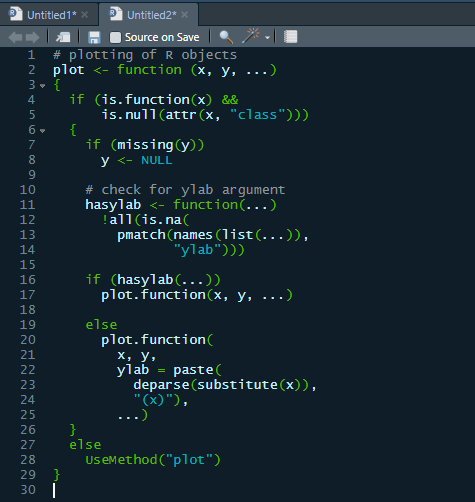

# RStudio Umi Theme

## Installation
First, make sure your version of RStudio is up to date (at least [v1.2](https://blog.rstudio.com/2019/04/30/rstudio-1-2-release/)).

You can install and change your theme directly by running the following line of R code in RStudio:
`rstudioapi::addTheme(https://raw.githubusercontent.com/braudm/rstudio_umi_theme/master/Umi.rstheme", apply = TRUE, force = TRUE, globally = FALSE)`

Or, you can do it manually through RStudio settings. Download the files and then go to `Tools > Global Options > Appearance > Editor theme > Add` and select the `Umi.rstheme` or `Umi.tmTheme` file. :)
